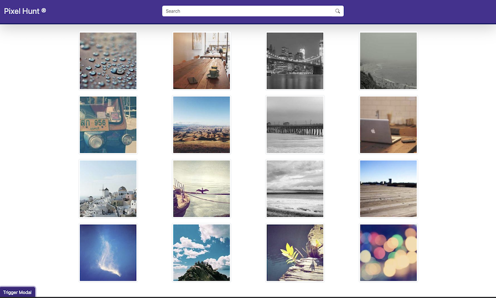

# L'MDb

[](https://goit-react-hw-05-levent.vercel.app/)

L'MDb is a movie search and review platform. Users can discover popular movies, view detailed movie information, explore the cast, and read movie reviews. This app is designed for movie enthusiasts with a user-friendly interface and rich features.

## Technologies Used

This project utilizes modern web development technologies. It was created with **Vite** to ensure a fast development process. **React Router** is used for navigation between pages, and **React Context API** manages global state. Data is fetched using **Axios** from the TMDB API and presented visually. The project is styled with **Sass** and **Bootstrap** for layout, while **Module CSS** is applied to individual components. The app is fully responsive across various screen sizes. Finally, the project is deployed using **Vercel**.

## Project Features

- **Movie Search**: Users can search for movies based on keywords.
- **Popular Movies**: The homepage displays a list of currently popular movies.
- **Movie Details**: Users can view detailed information about a movie by clicking on it.
- **Cast Information**: The movie details page shows the cast of the movie.
- **Movie Reviews**: Movie reviews are displayed on the details page for users to read.
- **Responsive Design**: The app is optimized for mobile devices and various screen sizes.

## How to Install

1. Clone the repository to your local machine:

```bash
git clone https://github.com/[YourUsername]/goit-react-hw-05.git
```

2. Navigate to the project directory:

```bash
cd goit-react-hw-05
```

3. Install the necessary dependencies:

```bash
npm install
```

4. Start the app in your local development environment:

```bash
npm run dev

```

Your app should now be running at http://localhost:3000

Deploying the Project
You can easily deploy this project to Vercel. Follow these steps:

Sign in to your Vercel account or create a new one: Vercel.
Click on "New Project" and select your GitHub repository.
Start the deployment process and wait a few seconds for the app to go live.
Once deployed, you can share the live link: https://goit-react-hw-05-levent.vercel.app/.
Contributing
If you'd like to contribute to this project, please report any bugs or issues before submitting a pull request. Your improvements and contributions will greatly enhance the project.
